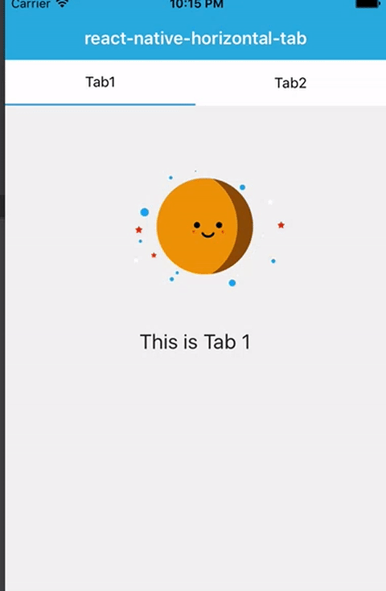

# react-native-horizontal-tab

`react-native-horizontal-tab`is built to provide a simple tab ui and event.




[Demo](https://github.com/JackPu/react-native-horizontal-tab/blob/master/example/index.ios.js)


### start

``` bash
npm install react-native-horizontal-tab --save-dev
```
how to use it?

``` 
var Tab = require('react-native-horizontal-tab');


//in JSX
<Tab idx={this.state.idx} tabClick={(idx) => this._handlePress(idx)} tabstr="tab1,tab2"></Tab>
```

### Options

+ `@tabstr` a string. the text shown on tab
+ `@idx` the index of tabs to show which is highlighted
+ `@tabClick` press event


### MIT LICENSE


